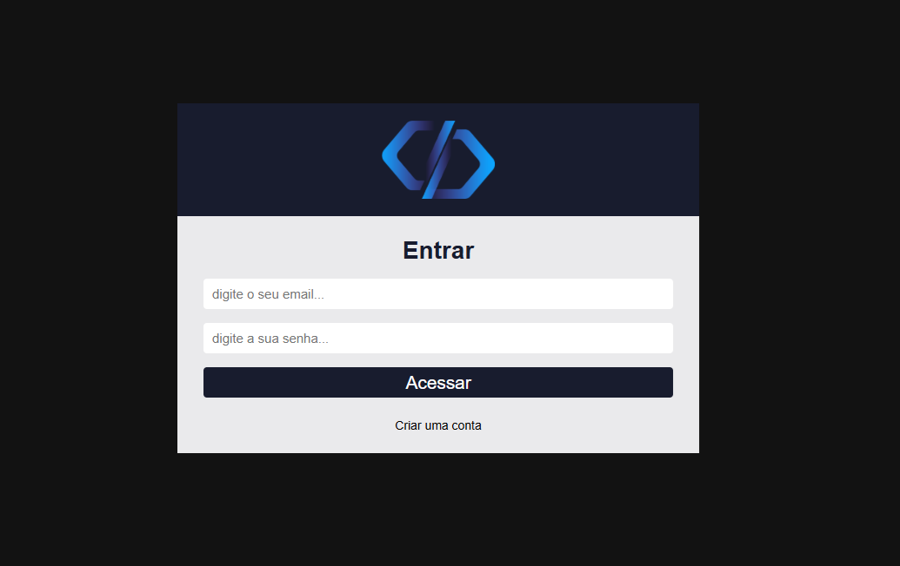
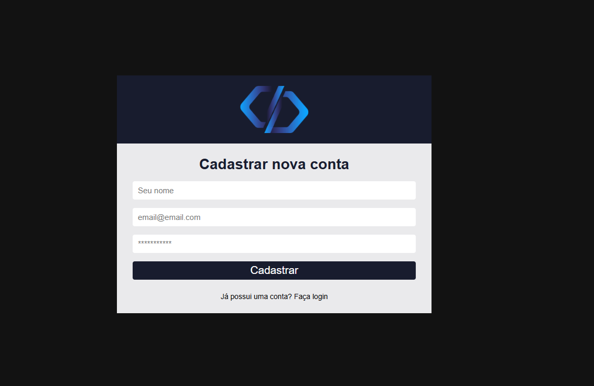
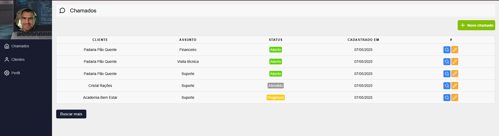
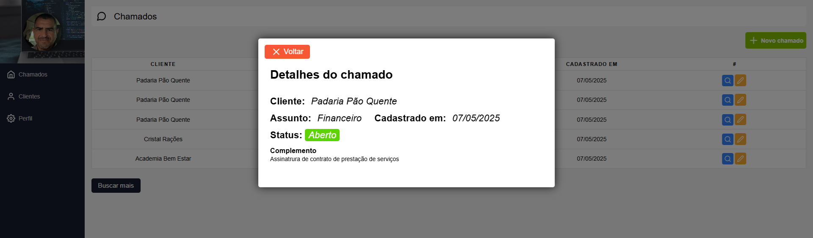
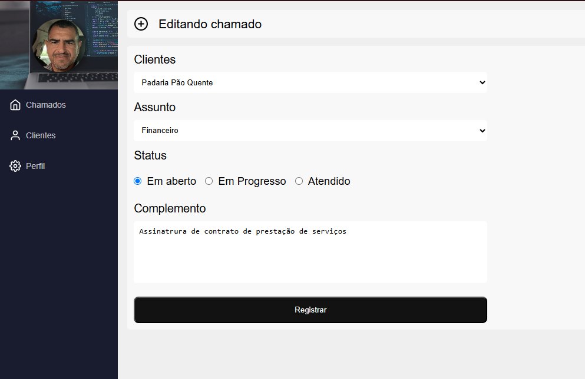
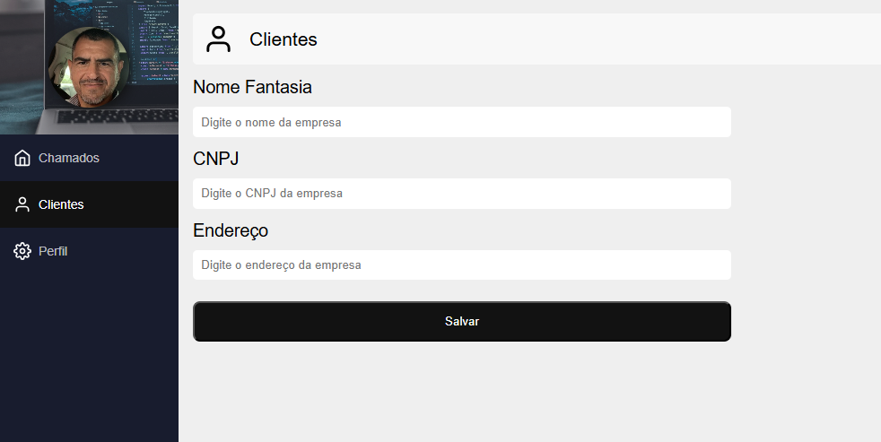
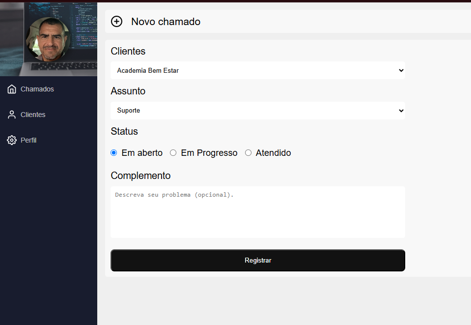
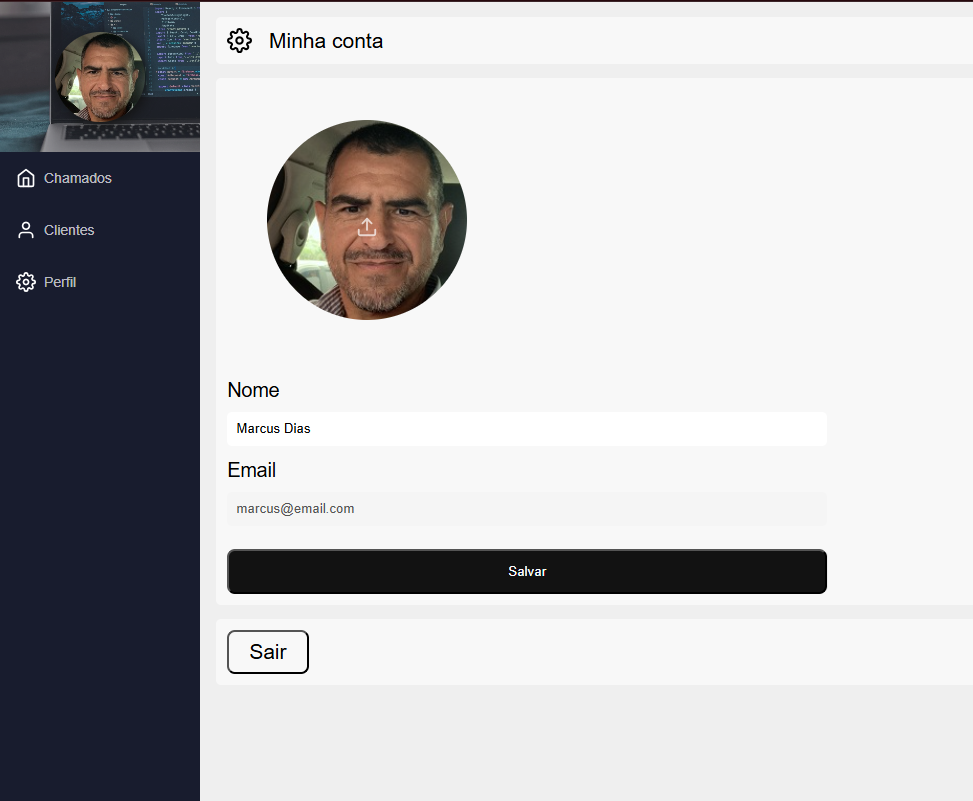

# App Chamados

**App Chamados** é uma aplicação que permite às empresas cadastradar e gerenciar chamados técnicos, de suporte e financeiro. O usuário pode abrir, atualizar o status dos chamados e visualizar os detalhes completos de cada chamado em uma janela modal.

## 🚀 Tecnologias Utilizadas

 
 
 


- **TypeScript**: Para garantir tipagem estática e segurança no código.
- **React**: Framework para criar a interface de usuário.
- **React Router Dom**: Para navegação entre páginas da aplicação.
- **Context API**: Para gerenciar o estado global da aplicação.
- **Firebase**: Para autenticação e armazenamento de dados.
- **Firestore**: Para persistência dos dados dos chamados.
- **React Icons**: Para ícones na interface.

### Gerenciamento de Chamados











## Instalação

1. Clone o repositório:
   ```bash
   git clone <URL-do-repositório>
   ```

2. Navegue até o diretório do projeto:
   ```bash
   cd nome-do-projeto
   ```

3. Instale as dependências:
   ```bash
   npm install
   ```

## Rodando o Projeto

1. Inicie o servidor de desenvolvimento:
   ```bash
   npm run dev
   ```

2. Acesse o aplicativo no seu navegador em [http://localhost:3000](http://localhost:3000).

## Funcionalidades

- **Criação de conta de usuário**: Crie uma conta de usuário para acessar o aplicativo completo.
- **Login na conta de usuário**: Usuários logados podem abrir chamados técnicos, de suporte e financeiros.
- **Abertura de Chamados**: Usuários logados podem abrir chamados técnicos, de suporte e financeiros.
- **Gerenciamento de Chamados**: Usuários logados podem atualizar o status de cada chamado.
- **Visualização Detalhada**: Exibição dos chamados completos em uma janela modal.
- **Tela Perfil Usuário**: Exibição das informações do usuário logado, e possibilidade de alteração dos dados.
- **Tela Cadastro de Cliente -Empresa**: Cadastrar empresas com cnpj e endereço.

## Contribuição

Este projeto foi desenvolvido pelo Curso React e JavaScript do prof. Matheus Fraga. Atualizei com a linguagem Typescript!

## Licença

Este projeto está sob a licença **MIT**.
<!-- Info criados pelo projeto - Templates e Eslint. -->
# React + TypeScript + Vite

This template provides a minimal setup to get React working in Vite with HMR and some ESLint rules.

Currently, two official plugins are available:

- [@vitejs/plugin-react](https://github.com/vitejs/vite-plugin-react/blob/main/packages/plugin-react/README.md) uses [Babel](https://babeljs.io/) for Fast Refresh
- [@vitejs/plugin-react-swc](https://github.com/vitejs/vite-plugin-react-swc) uses [SWC](https://swc.rs/) for Fast Refresh

## Expanding the ESLint configuration

If you are developing a production application, we recommend updating the configuration to enable type-aware lint rules:

```js
export default tseslint.config({
  extends: [
    // Remove ...tseslint.configs.recommended and replace with this
    ...tseslint.configs.recommendedTypeChecked,
    // Alternatively, use this for stricter rules
    ...tseslint.configs.strictTypeChecked,
    // Optionally, add this for stylistic rules
    ...tseslint.configs.stylisticTypeChecked,
  ],
  languageOptions: {
    // other options...
    parserOptions: {
      project: ['./tsconfig.node.json', './tsconfig.app.json'],
      tsconfigRootDir: import.meta.dirname,
    },
  },
})
```

You can also install [eslint-plugin-react-x](https://github.com/Rel1cx/eslint-react/tree/main/packages/plugins/eslint-plugin-react-x) and [eslint-plugin-react-dom](https://github.com/Rel1cx/eslint-react/tree/main/packages/plugins/eslint-plugin-react-dom) for React-specific lint rules:

```js
// eslint.config.js
import reactX from 'eslint-plugin-react-x'
import reactDom from 'eslint-plugin-react-dom'

export default tseslint.config({
  plugins: {
    // Add the react-x and react-dom plugins
    'react-x': reactX,
    'react-dom': reactDom,
  },
  rules: {
    // other rules...
    // Enable its recommended typescript rules
    ...reactX.configs['recommended-typescript'].rules,
    ...reactDom.configs.recommended.rules,
  },
})
```
